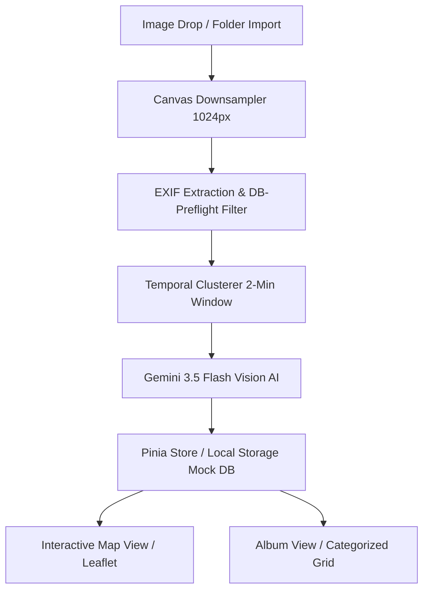

# 🧭 TrailTracker: AI-Driven Geospatial Media Catalog & Processing Pipeline

TrailTracker is a high-performance, responsive single-page web application engineered to process, catalog, and map outdoor adventure photography. By combining browser-level metadata parsing, client-side image processing, interactive maps, and AI computer vision, the platform automatically geolocates, summarizes, and tags hiking and camping photo collections.

---

## 🎨 System Overview & Core Features

TrailTracker is designed with two core views: the **Interactive Dashboard** (Map/Album views) and the **Intake Pipeline**.



### 1. Interactive Maps & Geospatial Data (Map View)
*   **Geospatial Visualization**: Renders coordinates on an interactive map using **Leaflet** with support for multiple tile layers (Satellite, Topographic, Light Positron, Dark Matter, OpenStreetMap, and a dedicated **Waymarked Trails hiking overlay**).
*   **Location Discovery Search**: Features an integrated OpenStreetMap Nominatim search bar directly in the map UI, allowing users to query cities, parks, and specific trails, instantly centering the map on the results.
*   **Custom Map Pins**: Displays custom-designed markers (e.g. campsite pins `⛺`) to visualize locations.
*   **Interactive Clusters**: Groups nearby markers dynamically to maintain performance and avoid overlap on broad zoom levels.

### 2. Categorized Album & Search (Album View)
*   **Dynamic Categorization**: Filters photos instantly into curated grids (e.g., "🐕 Basenjis", "🪧 Trail Signs", "🏔️ Scenic Vistas") powered by reactive Pinia computed properties.
*   **State Synchronization**: Automatically re-fetches data from the database the moment an intake upload batch completes, ensuring the UI stays perfectly synced with the server.
*   **Text Search Index**: Fully indexes image descriptions, landmarks, states, cities, and tags locally for real-time query searching.

### 3. Administrative Editing & Metadata Management
*   **Admin Mode Access**: Grants editing privileges allowing administrators to correct coordinates, landmarks, locations, description text, and tags.
*   **Expandable Georeferencing Modal**: The intake pipeline's mini-map features a full-screen expand toggle, providing administrators a massive, workable area for precise map searches and pin-dragging.
*   **Draggable Georeferencing**: Administrators can drag pins directly on the map interface. Pin relocation auto-updates the database coordinates in real-time.
*   **Granular Metadata Control**: View location confidence levels (High, Medium, Low, None) and AI reasoning details, edit tags in a clean forms panel, or delete photos from the library.

### 4. High-Throughput Intake Pipeline & Queue
*   **EXIF Parsing**: Extracts embedded GPS coordinates and timestamps directly in the browser via `ExifReader`.
*   **Clustering & Keeper Selection**: Groups duplicate photo bursts (taken within 2 minutes of each other) into clusters and calls Gemini to choose the single best "keeper" photo, filtering out sub-optimal or duplicate images.
*   **Queue Appending**: Dropping new image folders while the app is open automatically appends the files to the active queue instead of overwriting it, enabling progressive sorting.
*   **Skipped Items Tab**: Automatically sorts non-adventure files (e.g., indoor spaces, screenshots, parking lots) into a "Skipped" tab with AI-provided reasoning.
*   **🔧 Retroactive Photo Repair Tool**: A specialized drag-and-drop/browse interface that matches original high-resolution photos on your computer to existing database rows using the original filenames. It compresses them and overwrites the blurry files in Supabase Storage at **$0.00 Gemini API cost**, preserving all your custom metadata.

---

## 🏗️ Core Engineering Challenges & Solutions

### 1. Client-Side Memory & Image Quality Optimization
*   **Challenge**: Importing hundreds of raw camera photos (8MB–20MB each) caused browser tab crashes. Compressing them immediately to `1024px` at `70%` quality solved the RAM issue but made images look pixelated in the fullscreen lightbox. Furthermore, applying sharpening filters to already-compressed images caused double-compression and created a harsh, metallic "crosshatch" wire-mesh look.
*   **Solution**: Re-architected the pipeline into a **dual-resolution system**. During intake, the UI uses lightweight `1024px` previews, keeping RAM footprint under **35MB**. However, the system retains a lightweight `originalFile` pointer in memory (0MB RAM impact). At the moment of upload, the original file is processed and compressed in a single pass to **`2048px`** at **`85%` quality** with a **75% softer sharpening filter** (reducing center weight from `2.6` to `1.4`), resulting in pristine, natural-looking images on Retina and 4K displays.

### 2. CDN Caching & Real-Time Image Overwrites
*   **Challenge**: When the Repair Tool overwrites a blurry photo in Supabase Storage, the image URL remains identical. Because Supabase buckets are fronted by a Cloudflare CDN, the old `768x1024` image remains cached at the CDN level. Doing a hard refresh only clears local browser cache, leaving the blurry image on screen.
*   **Solution**: Implemented an app-wide reactive `cacheBuster` timestamp in the Pinia store. The moment a repair finishes, the store triggers the cache buster, and all active image components (`PhotoCard.vue`, `PhotoDetailPanel.vue`) immediately append a query parameter (`?cb=[timestamp]`) to their image sources. This forces Cloudflare to bypass the CDN cache and instantly load the new high-resolution image on the user's screen.

### 3. State-Aware Session Recovery & Cost Control
*   **Challenge**: Page refreshes or accidental interruptions cleared intake progress, forcing users to re-upload and pay double API fees for re-analyzing the same pictures.
*   **Solution**: Implemented a local persistence cache (`intake_analysis_cache` in `localStorage`) keyed by a sorted composite hash of filenames and timestamps. Before dispatching request blocks to Gemini, the pipeline checks the cache, instantly restoring completed analyses and conserving AI token cost.

### 4. Database-Level Duplicate Filtering
*   **Challenge**: Redundant uploads of identical files already present in the database wasted storage space and AI credits.
*   **Solution**: Implemented a database duplicate filter that compares incoming files against the library prior to ingestion. If a filename and EXIF timestamp match an existing record, the image is skipped upfront.

### 5. Leaflet Size Invalidation & UI Rendering
*   **Challenge**: Switching to the map tab after initializing it while hidden resulted in broken/warped tile alignments due to Leaflet caching a container size of `0x0`.
*   **Solution**: Configured tab-state bindings to call `map.invalidateSize()` after a `nextTick` transition whenever the map tab is selected, correcting layout renders instantly.

### 6. Custom Map UI & Cluster Rendering Fixes
*   **Challenge**: Adding search functionality caused UI control overlaps, and grouped photo clusters rendered invisibly on the map due to styling conflicts.
*   **Solution**: Re-architected Leaflet's control positions to cleanly align the Search, Zoom, and Layer tools. Implemented specific `.custom-cluster-marker` CSS logic to restore visibility to clustered coordinate groups at broad zoom levels.

---

## 🛠️ Technological Breakdown

*   **Frontend Framework**: Vue 3 (Composition API, `<script setup>`, TypeScript)
*   **State Store**: Pinia (reactive state stores, getters, and action triggers)
*   **Mapping Engine**: Leaflet (interactive maps, layers, event handling, draggable markers)
*   **AI Multimodal Vision**: `@google/generative-ai` (Gemini 3.5 Flash API integration with token tracking and rate limiting controls)
*   **Metadata Parser**: ExifReader
*   **Build System**: Vite & vue-tsc

---

## 📐 Multimodal Data Schema

The system directs the Gemini vision engine to generate responses adhering to this schema:

```typescript
interface GeminiAnalysis {
  is_adventure_photo: boolean;    // Filters out non-outdoor/non-wilderness photos
  selected_keeper: number;        // Index of the chosen keeper photo in a duplicate cluster
  location: string | null;        // Identified trail, peak, or national park name
  city: string | null;
  state: string | null;
  latitude: number | null;        // Estimated latitude if GPS is missing but landmark is identified
  longitude: number | null;       // Estimated longitude if GPS is missing but landmark is identified
  description: string | null;     // Descriptive caption of the photo contents
  tags: string[];                 // Array of classifiers (e.g. "scenic", "lake", "basenji")
  confidence: "HIGH" | "MEDIUM" | "LOW" | "NONE";
  reasoning: string;              // Contextual explanation for the AI's deductions
}
```

*Note: The system contains custom multimodal instructions to recognize specific recurring subjects, such as customized canine breeds by coat patterns (e.g. "Frida" as brindle Basenji and "Zuzu" as red-and-white Basenji), tagging and referencing them by name.*

---

## ⚙️ Setup & Installation

### Environment Configuration

Configure a `.env.local` file in the root directory:

```env
# Supabase Backend credentials (to connect actual backend database)
VITE_SUPABASE_URL=your_supabase_project_url
VITE_SUPABASE_ANON_KEY=your_supabase_anon_key

# Google Gemini API
VITE_GEMINI_API_KEY=your_gemini_api_key_here
```

### Installation Steps

1. Install project dependencies:
   ```bash
   npm install
   ```
2. Start the local Vite development server:
   ```bash
   npm run dev
   ```
3. Build the application for production:
   ```bash
   npm run build
   ```

---

## 🗺️ Future Roadmap

*   [ ] **Production Database**: Replace the client-side mock `localStorage` wrapper in `supabaseService.ts` with real PostgreSQL integration via `@supabase/supabase-js`.
*   [ ] **Cloud Storage Bucket**: Set up media uploads to an actual cloud storage bucket to host the pre-processed photography assets securely.
