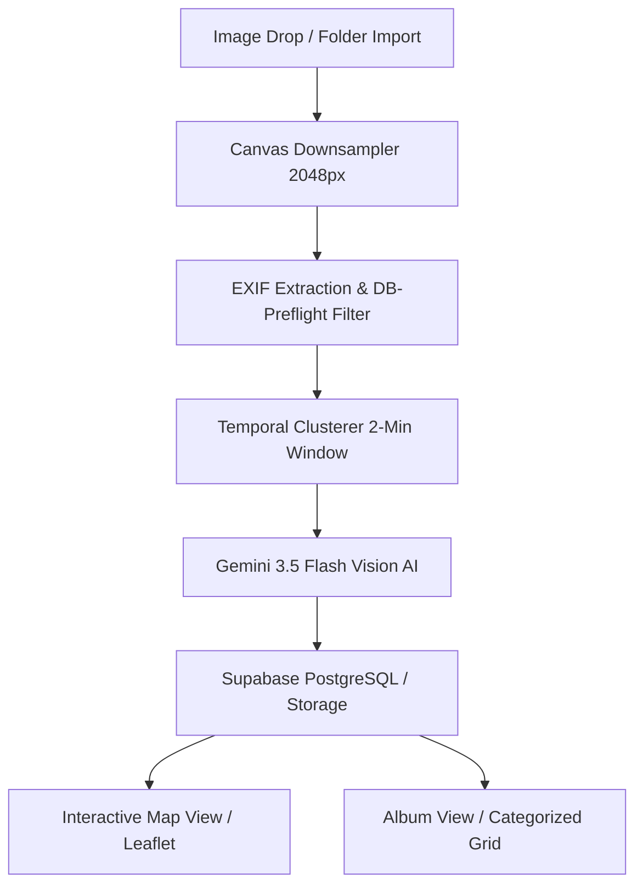

# 🧭 TrailTracker: AI-Driven Geospatial Media Catalog & Processing Pipeline

TrailTracker is a high-performance, responsive single-page web application engineered to process, catalog, and map outdoor adventure photography. By combining browser-level metadata parsing, client-side image processing, interactive maps, and AI computer vision, the platform automatically geolocates, summarizes, and tags hiking and camping photo collections.

---

## 🎨 System Overview & Core Features

TrailTracker is designed with three core views: the **Interactive Dashboard** (Map/Album views), the **Intake Pipeline**, and the **Repair Dashboard**.



### 1. Interactive Maps & Geospatial Data (Map View)
*   **Geospatial Visualization**: Renders coordinates on an interactive map using **Leaflet** with support for multiple tile layers (Streets, Light Positron, Topographic, Dark Matter, Satellite, and a dedicated **Waymarked Trails hiking overlay**).
*   **Custom Map Pins**: Displays custom-designed markers (e.g. campsite pins `⛺`) to visualize locations.
*   **Interactive Clusters**: Groups nearby markers dynamically to maintain performance and avoid overlap on broad zoom levels.
*   **Dynamic Fly-To**: Selecting a photo from the album or detail panel triggers a smooth camera flight to the exact geospatial coordinates on the map.

### 2. High-Performance Album View
*   **Stable Masonry Grid**: Displays photos in a fluid, column-based masonry layout that preserves the natural aspect ratio of every image. Portrait and landscape shots render side-by-side in their entirety with zero cropping or layout shift.
*   **Unified Global Filters Panel**: A slide-down glassmorphic drawer containing a full text search input, Category pills (All, Basenjis, Trail Signs, Scenic Vistas), and a State dropdown filter.
*   **State Normalization**: Automatically merges raw abbreviations (e.g. `CO`, `Co`, `CO` ➔ `Colorado`, `az` ➔ `Arizona`) dynamically on read and write, providing a clean, duplicate-free state selector list.
*   **State Synchronization**: Automatically re-fetches data from the database the moment an intake upload batch completes, ensuring the UI stays perfectly synced with the server.

### 3. Administrative Editing & Metadata Management
*   **Admin Mode Access**: Grants editing privileges allowing administrators to correct coordinates, landmarks, locations, description text, and tags.
*   **Expandable Georeferencing Modal**: The intake pipeline's mini-map features a full-screen expand toggle, providing administrators a massive, workable area for precise map searches and pin-dragging.
*   **Draggable Georeferencing**: Administrators can drag pins directly on the map interface. Pin relocation auto-updates the database coordinates in real-time.
*   **Granular Metadata Control**: View location confidence levels (High, Medium, Low, None) and AI reasoning details, edit tags in a clean forms panel, or delete photos from the library.
*   **Aspect-Ratio Conforming Preview**: The sidebar details panel centers and fits the selected image to its native aspect ratio (with a max-height limit) to display portrait subjects fully without cropping.

### 4. High-Throughput Intake Pipeline & Queue
*   **EXIF Parsing**: Extracts embedded GPS coordinates, image widths, heights, and timestamps directly in the browser via `ExifReader`.
*   **Clustering & Keeper Selection**: Groups duplicate photo bursts (taken within 2 minutes of each other) into clusters and calls Gemini to choose the single best "keeper" photo, filtering out sub-optimal or duplicate images.
*   **Queue Appending**: Dropping new image folders while the app is open automatically appends the files to the active queue instead of overwriting it, enabling progressive sorting.
*   **Skipped Items Tab**: Automatically sorts non-adventure files (e.g., indoor spaces, screenshots, parking lots) into a "Skipped" tab with AI-provided reasoning.
*   **🔧 Retroactive Photo Repair Dashboard**: A dedicated dashboard with a drag-and-drop/browse interface that matches original high-resolution photos on your computer to existing database records. It compresses the files and overwrites them in Supabase Storage at **$0.00 Gemini API cost**, preserving all metadata while remaining strictly decoupled from the main intake pipeline.

---

## 🏗️ Core Engineering Challenges & Solutions

### 1. Client-Side Memory & Image Quality Optimization
*   **Challenge**: Importing hundreds of raw camera photos (8MB–20MB each) caused browser tab crashes. Compressing them immediately to `1024px` at `70%` quality solved the RAM issue but made images look pixelated in the fullscreen lightbox.
*   **Solution**: Re-architected the pipeline into a **dual-resolution system**. During intake, the UI uses lightweight `1024px` previews, keeping RAM footprint under **35MB**. The system retains a lightweight `originalFile` pointer in memory. At the moment of upload, the original file is processed and compressed in a single pass to **`2048px`** at **`85%` quality** without any artificial sharpening or enhancement filters to avoid double-compression artifacts, preserving the pure original shot.

### 2. Egress Bandwidth & Caching Strategy (Cloudflare CDN & Local Cache)
*   **Challenge**: Standard media loading from Supabase Storage buckets consumed substantial egress bandwidth, creating scaling quota risks.
*   **Solution**: 
  - **Storage Caching**: Programmed the upload pipeline to apply a `1-year cache control` header (`public, max-age=31536000`) on all image uploads to Supabase, enabling Cloudflare's CDN and browsers to serve assets directly from cache.
  - **Metadata Cache**: Implemented frontend `sessionStorage` caching inside the Pinia store. Subsequent app loads resolve database metadata directly from local memory storage rather than querying the SQL backend repeatedly on page refresh.

### 3. Eliminating Layout Shift (CLS) in Masonry Grids
*   **Challenge**: Dynamic masonry structures suffer from Cumulative Layout Shift (CLS) while images are downloading, causing elements to jump vertically as dimensions resolve.
*   **Solution**: Analyzed image dimensions dynamically on the client side using a browser-based image parser during upload, saving width and height columns directly to the SQL database. Applied inline `aspect-ratio` CSS values to photo cards and loaded shimmering skeleton placeholder frames in the grid, ensuring layouts remain perfectly static while images load in the background.

### 4. CDN Caching & Real-Time Image Overwrites
*   **Challenge**: When the Repair Tool overwrites a blurry photo in Supabase Storage, the image URL remains identical. Because Supabase buckets are fronted by a Cloudflare CDN, the old `768x1024` image remains cached at the CDN level. Doing a hard refresh only clears local browser cache, leaving the blurry image on screen.
*   **Solution**: Implemented an app-wide reactive `cacheBuster` timestamp in the Pinia store. The moment a repair finishes, the store triggers the cache buster, and all active image components (`PhotoCard.vue`, `PhotoDetailPanel.vue`) immediately append a query parameter (`?cb=[timestamp]`) to their image sources. This forces Cloudflare to bypass the CDN cache and instantly load the new high-resolution image on the user's screen.

### 5. Detail Panel UX & Auto-Dismissal
*   **Challenge**: Open photo detail panels stayed active during view shifts or scrolling, creating visual overlaps and covers.
*   **Solution**: Configured watcher callbacks to clear the active selection when toggling views (Map vs Album) or tabs, and added scroll listeners on the grid container to close detail panels when scrolling away to browse.

### 6. High-Contrast Scrollbars
*   **Challenge**: Default browser scrollbar tracks were narrow and lacked contrast against the application's dark mode visual layout.
*   **Solution**: Custom-built custom webkit scrollbar tracks with double thickness (16px) and high-contrast styling to optimize scroll readability and clicking in desktop browsers.

---

## 🛠️ Technological Breakdown

*   **Frontend Framework**: Vue 3 (Composition API, `<script setup>`, TypeScript)
*   **State Store**: Pinia (reactive state stores, getters, and action triggers)
*   **Database & Storage**: Supabase (PostgreSQL, Supabase Auth, Storage bucket pipelines)
*   **Mapping Engine**: Leaflet (interactive maps, layers, event handling, draggable markers)
*   **AI Multimodal Vision**: `@google/generative-ai` (Gemini 3.5 Flash API integration with token tracking and rate limiting controls)
*   **Metadata Parser**: ExifReader
*   **Build System**: Vite & vue-tsc

---

## 📐 Multimodal Data Schema

The system directs the Gemini vision engine to generate responses adhering to this schema:

```typescript
interface GeminiAnalysis {
  is_adventure_photo: boolean;    // Filters out non-outdoor/non-wilderness photos
  selected_keeper: number;        // Index of the chosen keeper photo in a duplicate cluster
  location: string | null;        // Identified trail, peak, or national park name
  city: string | null;
  state: string | null;
  latitude: number | null;        // Estimated latitude if GPS is missing but landmark is identified
  longitude: number | null;       // Estimated longitude if GPS is missing but landmark is identified
  description: string | null;     // Descriptive caption of the photo contents
  tags: string[];                 // Array of classifiers (e.g. "scenic", "lake", "basenji")
  confidence: "HIGH" | "MEDIUM" | "LOW" | "NONE";
  reasoning: string;              // Contextual explanation for the AI's deductions
}
```

*Note: The system contains custom multimodal instructions to recognize specific recurring subjects, such as customized canine breeds by coat patterns (e.g. "Frida" as brindle Basenji and "Zuzu" as red-and-white Basenji), tagging and referencing them by name.*

---

## ⚙️ Setup & Installation

### Environment Configuration

Configure a `.env.local` file in the root directory:

```env
# Supabase Backend credentials
VITE_SUPABASE_URL=your_supabase_project_url
VITE_SUPABASE_ANON_KEY=your_supabase_anon_key

# Google Gemini API
VITE_GEMINI_API_KEY=your_gemini_api_key_here
```

### Installation Steps

1. Install project dependencies:
   ```bash
   npm install
   ```
2. Start the local Vite development server:
   ```bash
   npm run dev
   ```
3. Build the application for production:
   ```bash
   npm run build
   ```
